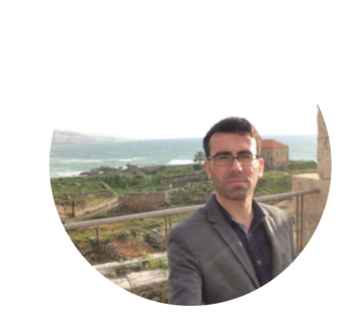

<style>
d-title, d-byline {
  display: none
}
</style>


```{css, echo = FALSE}
.columnname {
  font-size: 1.4rem; 
  font-weight: 600
}
.grad-item {
  list-style: none; 
  background-image: url(images/cap.png); 
  background-repeat: no-repeat;  
  background-size: 1.2rem; 
  padding-left: 2rem;
}
.grad-location {
  font-size: 1.1rem;
  color: #0D7680;
}

```


<div class=profile>


<h1 style="font-size:30px"> Muhsin Ciftci </h1>

[`r fontawesome::fa("envelope")`](mailto:farmer.muhsin@gmail.com)
[`r fontawesome::fa("linkedin")`](https://www.linkedin.com/in/muhsinciftci/)
[`r fontawesome::fa("twitter")`](https://twitter.com/ciftciphd)
[`r fontawesome::fa("github")`](https://github.com/muhsinciftci)
<a href="https://muhsinciftci.netlify.app/files/CV.html"><i class="square"></i>CV</a><br>
</div>

I am a Ph.D. Candidate in Economics at Goethe University Frankfurt School of Economics. My research interests are macroeconomics and applied econometrics. I am also interested in the application of machine learning to economics and how alternative ways can change the ways we understand the data.
  
Before joining Goethe University Frankfurt, I received a Master of Science in Economics from Middle East Technical University and at the same time, I worked as a researcher at the Central Bank of Turkey. I received a Bachelor of Arts in Economics from Bogazici University.

  


:::: {style="display: grid; grid-template-columns: 40% 50%; grid-column-gap: 30px; line-height: 1.5rem;"}

::: {}
<span class = "columnname"> Interests </span>

* Macroeconomics

* Applied Econometrics

* Machine Learning
:::


::: {}
<span class = "columnname"> Education </span>

<ul>
 
<li class = "grad-item">   PhD in Economics, 2019 - Present <br> <p class = "grad-location"> Goethe University Frankfurt, Germany </p> </li>
<br>
<li class = "grad-item">   MSc in Economics, 2017 - 2019 <br>
<p class = "grad-location"> Middle East Technical University, Turkey </p> </li>
<br>
<li class = "grad-item">   BA in Economics, 2010 - 2015 <br> <p class = "grad-location"> Bogazici University, Turkey </p> 
</li>

</ul>
:::


::::

---

```{r echo=FALSE}
library(fontawesome)
```

<center>
<main style="font-size:15px"> &copy; Muhsin Ciftci, `r format(Sys.time(), '%Y')`. Created with `r fa("r-project", fill = "#0D7680")` Distill Package. </main>
</center>


```{r, include=FALSE, results='asis'}
library(metathis)
meta() %>%
  meta_social(
    title = "MC",
    description = "Personal academic website of Muhsin Ciftci",
    url = "https://muhsinciftci.netlify.app/",
    image = "https://github.com/muhsinciftci/mydistill-website/blob/main/images/ciftci.png",
    image_alt = "",
    og_type = "website",
    og_author = "Muhsin Ciftci",
    twitter_card_type = "summary",
    twitter_creator = "@ciftciphd"
  )
```

